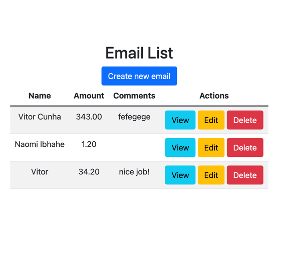

# Email fetching and parsing project for UseTwelve


## Overview

This project is a simplified full-stack application built with Python and Django. It parses emails, extracts specific information (such as name, amount, and comments), stores this information in a database, and provides a basic front-end interface to display and manage the stored data.

Explanation on youtube: https://youtu.be/fKLhQ_NSNGA

## Features

- Fetch emails from a specified email account
- Extract basic information such as name, amount, and comments from incoming emails
- Store the extracted information in a SQLite database
- Provide a simple user interface to display the stored data in a tabular format
- Implement basic CRUD operations (Create, Read, Update, Delete) for the displayed data
- Log activities and errors for monitoring and debugging
- Schedule periodic email fetching using django-cron

## Requirements

- Python 3.6+
- Django 3.0+
- requests
- django-cron

## Setup

### Step 1: Clone the Repository

```bash
git clone https://github.com/vitorrcunhaa/email_parser.git
cd email-parser
```

### Step 2: Create and Activate a Virtual Environment

```bash
python3 -m venv venv
source venv/bin/activate
```

### Step 3: Install dependencies

```bash
pip install -r requirements.txt
```

### Step 4: Apply Migrations

```bash
python manage.py migrate
```

### Step 5: Create a Superuser

```bash
python manage.py createsuperuser
```

### Step 6: Run the Application

```bash
python manage.py runserver
```
Access the application at http://127.0.0.1:8000/ and the admin interface at http://127.0.0.1:8000/admin/.

### Step 7: Manually Run Cron Job

```bash
python manage.py runcrons
```

## Usage

Email Fetching and Parsing

The cron job will fetch emails from the specified email account, parse the content, and store the extracted data in the database. The fetch and parse process is logged for monitoring and debugging.

CRUD Operations

The application provides a basic user interface to manage the stored email data:

	•	List View: Displays all stored email data in a tabular format.
	•	Detail View: Shows detailed information about a specific email entry.
	•	Create View: Allows adding a new email entry manually.
	•	Update View: Allows editing an existing email entry.
	•	Delete View: Allows deleting an email entry.

Logging

All activities and errors during the email fetching and parsing process are logged in email_parser.log.